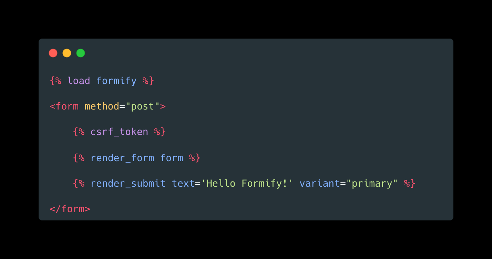

<h1>Django Formify</h1>

Django-Formify seamlessly integrates Tailwind CSS styles into your Django forms for a modern look.

<strong><a href="https://django-formify.readthedocs.io/en/latest/">Documentation</a> &nbsp;|&nbsp; <a href="https://saashammer.com/lookbook/inspect/form_component/form_fields/">Demo site</a></strong>

## Documentation

[Documentation](https://django-formify.readthedocs.io/)

## FAQ

### Django-Formify vs Crispy-Tailwind

1. Django-Formify is a fork of Crispy-Tailwind, the core logic is the same.
2. Django-Formify changed the way of rendering, to make it more flexible and easy to customize.
3. Django-Formify import components from Django-ViewComponent, which makes the components more reusable and easy to maintain. Developers can also create their own components to fit their needs.
4. Django-Formify updated some widgets such as file input to make them look better with Tailwind CSS.
