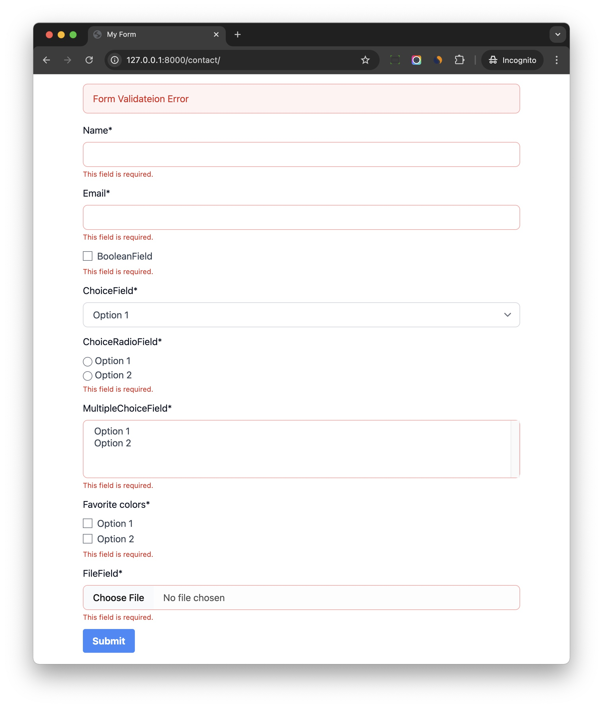

# Get Started

## Simple Form Rendering

Let's assume you already have Django forms.

To render the form with good style in the template

```html


<!DOCTYPE html>
<html>
<head>
  <title>My Form</title>
  <script src="https://cdn.tailwindcss.com?plugins=forms"></script>
</head>
<body>

<div class="w-full max-w-3xl mx-auto px-4">
  <form method="post">
    
    

    
    
    
    
  </form>
</div>

</body>
</html>
```

Notes:

1. We `` at the top to use relevant tags.
2. We use `<script src="https://cdn.tailwindcss.com?plugins=forms"></script>` to import Tailwind CSS and the `form` plugin, this is for testing purpose only.
3. `` is to iterate form fields and display all the fields with their labels and errors.
4. `` is to help render submit button with custom text and CSS class.


It will also help display form non-field errors and form field errors as well.



## Render Fields Manually

If you want more control of the form layout, you can render fields manually.

```html


<!DOCTYPE html>
<html>
<head>
  <title>My Form</title>
  <script src="https://cdn.tailwindcss.com?plugins=forms"></script>
</head>
<body>

<div class="w-full max-w-3xl mx-auto px-4">
  <form method="post">

    

    <div class="grid grid-cols-12 gap-3">
      <div class="col-span-12 md:col-span-6">
        
      </div>
      <div class="col-span-12 md:col-span-6">
        
      </div> 
    </div>
    
    

  </form>
</div>

</body>
</html>
```

Notes:

You can use `` to render specific form field.
