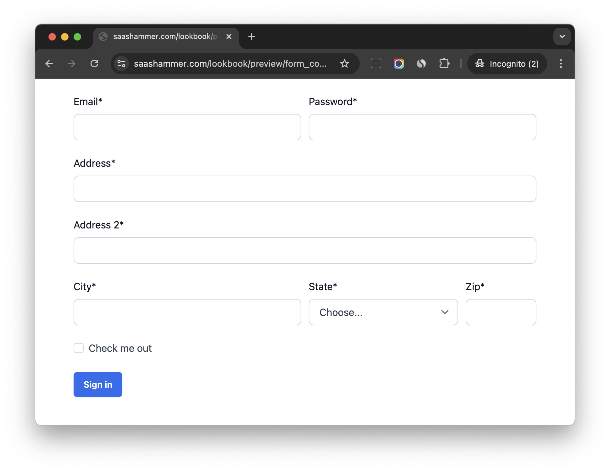
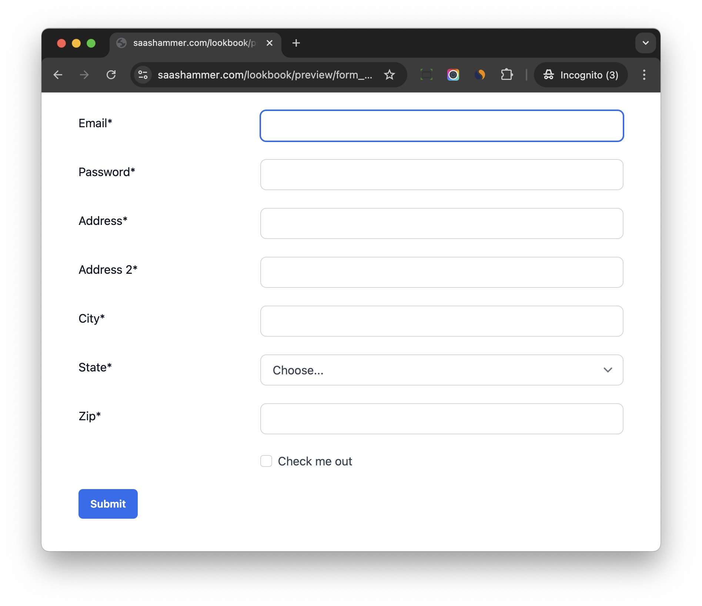

# Layout

## Usage

The layout is to help control the form layout in Python code.

This feature is inspired from `django-crispy-forms`

```python
from django_formify.tailwind.layout import Div, Field, Layout, Submit


class ExampleForm(forms.Form):
    
    def __init__(self, *args, **kwargs):
        super().__init__(*args, **kwargs)
        self.formify_helper = FormifyHelper()
        self.formify_helper.layout = Layout(
            Div(
                Div(
                    Field("email"),
                    css_class="col-span-12 md:col-span-6",
                ),
                Div(
                    Field("password"),
                    css_class="col-span-12 md:col-span-6",
                ),
                Div(
                    Field("address"),
                    css_class="col-span-12",
                ),
                Div(
                    Field("address2"),
                    css_class="col-span-12",
                ),
                Div(
                    Field("city"),
                    css_class="col-span-12 md:col-span-6",
                ),
                Div(
                    Field("state"),
                    css_class="col-span-12 md:col-span-4",
                ),
                Div(
                    Field("zip_code"),
                    css_class="col-span-12 md:col-span-2",
                ),
                Div(
                    Field("check_box"),
                    css_class="col-span-12",
                ),
                Div(
                    Submit(text="Sign in"),
                    css_class="col-span-12",
                ),
                css_class="grid grid-cols-12 gap-3",
            ),
        )
```



The `django_formify.tailwind.layout` current contains below classes for developers to use:

- Layout
- Div
- HTML
- Button
- Submit
- Reset
- Field
- Fieldset

## Django-ViewComponent

The layout classes from `django-crispy-forms` is built tightly with `django-crispy-forms` project itself, if I want to use them to render HTML from Python code, then it would be hard to get it work.

So I want to choose a robust component solution:

1. The solution can let developers build custom components as they like.
2. `Django-Formify` just pass `context` to the components, and use the components to render HTML.

[django-viewcomponent](https://github.com/rails-inspire-django/django-viewcomponent) is the component solution I chose, it provides easy way to let developer build custom components.

The components in `django_formify.tailwind.layout` are all built using `django-viewcomponent`.

You can also build custom components to fit your needs, for example, if you want to use `Accordion` to generate complex form, you can build `Accordion` and `AccordionSection` components using `django-viewcomponent`.

And then you can use them like this:

```python
class ExampleForm(forms.Form):

    def __init__(self, *args, **kwargs):
        super().__init__(*args, **kwargs)
        self.formify_helper = FormifyHelper()
        self.formify_helper.layout = Layout(
            Accordion(
                AccordionSection(
                    ...
                ),
                AccordionSection(
                    ...
                ),
                AccordionSection(
                    ...
                ),
                dom_id="accordion-1"
            ),
        )
```

What is more, after creating `Accordion` component, you can also use them in normal web pages as well (not just in form rendering), which is convenient.


## Horizontal Form

Some people might have heard of a horizontal form, where the field labels and fields are arranged side by side

To make it work, please check below code

```python
form.formify_helper = FormifyHelper()
form.formify_helper.field_wrapper_class = "md:flex md:items-center mb-6"
form.formify_helper.field_wrapper_component = (
    "formify.tw.horizontal_field_wrapper"
)
```

`formify.tw.horizontal_field_wrapper` is a Component (built on django-viewcomponent) for horizontal layout, it can add css classes to the `label` and `field` to make them display side by side.


